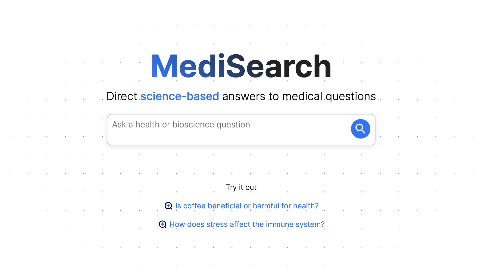

# MediSearch frontend take-home test Part 2

## Description

In this frontend coding test, you will implement an animation within the MediSearch frontend.

## Specification

Firstly, please create a fork of this repository.

We have created a NextJS application you can find in this repo. As a first step, please run `npm install && npm run dev` and let us know if you run into issues viewing the app on localhost. The application should look something like:

The goal of the project is to animate the "Try it out" links. The output should look something like the videos in the files `moving_links_desktop_demo.mov` and `moving_links_mobile.MP4`.

Some requirements are:

1. Animation:

- The "Try it out" links should be animated to be horizontally scrolling from right to left.
- The animation should work with any finite number of "Try it out" links.
- The animation should be circular. That is, once a link scrolls out of view of the left side, it should reappear on the right side at some point.
- The animation should be smooth, continuous, and without lags.

2. Scroll:

- The animation should interact naturally with the user's scroll. When the user presses on the try it out links, the animation should stop and the user should be able to scroll the "Try it out" links horizontally. When the user stops scrolling, the animation should resume. You are only required to implement this scrolling feature for mobile. However,
  make sure that the animation works and the UX is natural on desktop too.

3. Test that everything works nicely on ios, android, and desktop. We use https://www.lambdatest.com/ for this. Feel free to use any tool you want. If you don't have access to any tool, we will refund you a lambdatest subscription.

## Submission instructions

Simply email eduard@medisearch.io and give EduardOravkin access to the repo.
